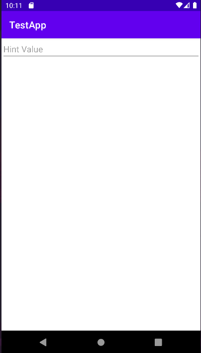

# CapML
#### Capone Markup Language
A minimal, declarative markup language for Android UI. 
.capml files can be parsed from storage, and render elements quickly at runtime.

```
CapML
'~' - Denotes the type of Android UI Element.
'+' - Denotes the user facing content of the Element. Can be one line or many lines.
'-' - Denotes end of defining element.
'#' - Denotes Comment

All lines end in newline.

Ex.

~ET
+ Hint Value
-
```

The above produces:


Current widgets -> Tag? Decorator?:
 - CheckBox -> CB
 - EditText -> ET
 - TextView -> TV
 - Spinner -> SP


### Prerequisites

 - Android SDK 30 which can be gotten [here](https://developer.android.com/studio/index.html#command-tools)
Or more easily, [here](https://developer.android.com/studio)

 - You can use the gradle wrapper or download gradle [here](https://gradle.org/install/)

 - Git

### Installing


If using Android Studio, create a new module under the root of the project.
You should be able to set up a Blank Activity Application from the menu.
In the Application's module level build.gradle, add the following line:

```groovy
dependencies{
    implementation(project(path: ":CapML"))
}
```

Run `./gradlew build` or `.\gradlew.bat build` to generate an aar file at
`./CapML/build/outputs/aar/CapML-debug.aar` if you want to add it to another project,

## Running the tests

Eventually? `./gradlew test` and `./gradlew connectedAndroidTest`

## Deployment

Build the aar file and add it to your project source code. 
Then add it as a dependency to your project.

## Built With
Uh?

- [Creative Commons](https://creativecommons.org/) - Used to choose
  the license

## Contributing

Eventually will probably have guidelines

## Versioning

We use [Semantic Versioning](http://semver.org/) for versioning.

Current Version: 0.0.1

## Authors
- **Dennis Capone** - *Wrote alpha parser*- 
  [dcap0](https://github.com/dcap0)
  
## License

Haven't decided yet!

## Acknowledgement
 - That weird state where your too tired but can't stop.